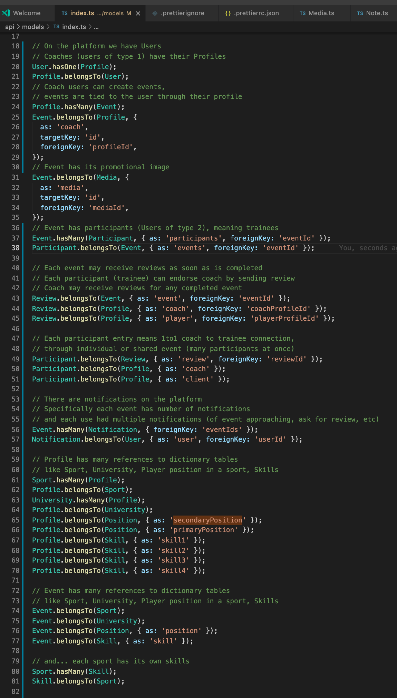

# Vantage-Sports

This Repo holds two projects managed with Yarn:

- client - SPA in React and GraphQL via Apollo
- backend - a Node.JS GraphQL Postgress data API deployed to Heroku

All instructions are Mac focused, you may need to adapt for windows platforms.
Update: We now have [Windows](#windows) installation instructions too.
We use path.join where needed so every file reference should also work on windows.

## Table of Contents

- [Getting Started](#getting-started)
- [Test data](#test-data)
- [Running concurrently](#running-concurrently)
- [Environments](#environments)
- [Databases](#databases)
- [Database schema](#database-schema)
- [Database backup](#database-backup)
- [Database restore](#database-restore)
- [GraphQL](#graphql)
- [Heroku](#heroku)
- [Deployments](#deployments)
- [Database Migrations](#database-migrations)
- [Undo Migration](#undo-migration)
- [Migration Compilation](#migration-compilation)
- [Windows](#windows)
- [Production Release](#production-release)

# Getting Started

Note: if something is unclear, please refer to [Windows](#windows) installation instructions which are a little bit more step by step.

- Backend getting started:
  - [Download](https://www.enterprisedb.com/downloads/postgres-postgresql-downloads) and install postgreSQL.
  - In your favorite Database admin tool create a new database called vantage_dev
    with a user vantage having rights. For development I leave the database
    password blank (note the config/connection.ts file). Example database tools are: DBeaver or pgAdmin 4.
  - In repository root folder run `nvm use`, [if you don't know nvm, see this Readme](https://github.com/nvm-sh/nvm). If running for the first time you may need to first install NVM and run `nvm install 14.17.6`.
  - In ./backend folder run
    `yarn`
  - Copy `.env.example` and save as `.env`
  - In ./backend folder run the sequelize database migrations
    `yarn init:db:migrate `
    please note that `yarn compile-ts-to-js-for-db` has been run in the background for you.
  - Also in ./backend folder run the database seeds
    `yarn init:db:seed:all`
  - To start the backend in the backend/api folder run
    `yarn start`
  - this needs to remain running and needs to be restarted when backend/api
    changes are made

PS: you can also run HTTPS on localhost if you add `HTTPS=true` to either `.env` or in front of the start command.

- Frontend getting started:
  - in another terminal
  - In ./client run
    `yarn install`
  - To start the client run
    `yarn start`

Instructions for windows Users

- Use git bash cli for running the .sh files (deploy.sh or deploy_dev.sh or migrate_dev.sh)
- Globally install yarn before using deploy_dev.sh script
- Review the Readme in each sub project for more information

## Test data

After properly seeding the database there should be the following profiles created:

```
User: coach@gmail.com, password: coach
Player: player@gmail.com, password: player
Test Credit card: 4242 4242 4242 4242
```

## Running concurrently

Running concurrently both frontend and backend from root directory.

1. Make sure you use the Node.js version required (run `nvm use` in root directory), [if you don't know nvm, see this Readme](https://github.com/nvm-sh/nvm).
2. From root execute:

```
yarn start
```

under the hood it will start both client and api for you locally. (see package.json in the root directory)

# Environments

We have 4 environments:

- local - your local machine, run on localhost (most likely SPA on port 3000 and database on 2017)
- dev - development environment where you deploy when finished working on a feature and verified it works locally
- dev2 - second development environment, sometimes called staging, more or less the same as dev
- production - production app

# Databases

We use postgres for all environments.
See database configuration per environment in backend/config/connection.ts.

# Database schema

We have rather complex database schema of many connected tables. However one day I wrote a quick story about them so you can understand them better. See [models/index.ts](./backend/api/models/index.ts) for the most recent version.


# GraphQL

We are using GraphQL to communicate FE-BE. When playing with queries you can use graphql playground at [http://localhost:2017/graphql](http://localhost:2017/graphql) (assuming you run BE at 2017 port).

# Heroku

Our apps run on Heroku. Make sure to get access to relevant environments from Jason W or Mateusz G.

- [install heroku CLI](https://devcenter.heroku.com/articles/heroku-cli#verify-your-installation)
- make sure your CLI is ready to go
  `heroku --version`
- login to Heroku
  `heroku login`

# Deployments

For you convenience there are 3 small and obscure deployment scripts:

- deploy.sh - for production deployment
- deploy_dev.sh - for dev deployment
- deploy_dev2.sh - for dev2/staging deployment

## Automatic deployments

We automate deployments using GitHub actions.
See [workflow.yml](/./.github/workflows/workflow.yml) how it is configured.
TLDR:

- when PR is merged to main branch on GitHub then deploys to dev

## How to run deployment

- On your local machine commit everything and push.
- Make sure there are no new files in the repository changelog
- Verify everything works.
- Backup Database for prod AND environment you want to deploy to. Use your favorite Database manager like DBeaver or pgAdmin 4. For convenience choose method "plain" and save to file with extension ".sql". Include CREATE/DROP database statements.
- Verify using your favorite IDE that backup sql files are correct.
- In repository root folder run deployment script:

```
sh deploy_dev.sh
```

- wait aproximately 5-10mins

# Database Migrations

- On your local machine commit everything and push.
- Make sure there are no new files in the repository changelog
- Verify everything works.
- Backup database for prod AND environment you want to migrate DB for. Use your favorite DB manager like DBeaver or pgAdmin 4. For convenience choose method "plain" and save to file with extension ".sql". Include CREATE/DROP database statements.
- Verify using your favorite IDE that backup sql files are correct.

- In /backend folder run
  `yarn && yarn compile-ts-to-js-for-db`
- Check migration status by running:

```
# Replace environment!
sh ./scripts/dev-status-migrate.sh
```

- In /backend folder run migration script:

```
# Replace environment!
sh ./scripts/dev-migrate.sh
```

- wait up to 5mins

- Remember to always perform `yarn compile-ts-to-js-for-db` whenever changing migration scripts.

## Undo Migration

You can execute migration down() to step down from certain migration to f.in. checkout other branch.

- In /backend folder run migration script:

```
# Replace environment!
sh ./scripts/dev2-undo-one-migrate.sh
```

## Migration Compilation

Remember that migrations need to be compiled from TypeScript to JavaScript.
You cannot execute .ts migration.

Compilation is done using:

```
yarn compile-ts-to-js-for-db
```

Then you can check your compiled JavaScript migrations under /backend/api/db/compiled/api/db/migrations.

## Windows

1. Download and install [nvm-windows](https://github.com/coreybutler/nvm-windows/releases). Make sure to install globally. Exe file to be found in assets under the linked page.
2. Open command line (cmd). Run `nvm install 14.17.6`.
3. Download favorite IDE. For instance we recommend [Visual Studio Code](https://code.visualstudio.com/) as default plugin extensions will be suggested to you.
4. Download and install PostgreSQL. [Download link](https://www.postgresql.org/download/windows/). Make sure to install pgAdmin 4 as well (should be selected by default). Choose password as "1" and put it into "connection.ts" within `development` connection. Password defaults to empty string which is not the case for Windows, as installer asks you to set password. Alternatively you can use `.env` file described in step (9.) to avoid any git changes being picked up.
5. In pgAdmin 4 create user `vantage` (as superuser). This can be seen under Login/Groups and phrased "Create Login". To make it a superuser see privileges tab and assign all privileges to the user.
6. In pgAdmin 4 create first database with a name `vantage_dev`.
7. _Very important:_ Open your favorite IDE in Administrator mode (_run as Administrator_). Then in terminal window run `nvm use 14.17.6`. Terminal should show message "Now using node v14.17.6 (64-bit)" - if the message is different then please resolve any issues. If it shows that you have no privilages, then see the beginning of this step: you need to run Visual Studio Code as administrator! Just logging in as administrator account is not enough, you need to right click on launcher `.exe` and choose "run as administrator".
8. In the very same command line install `yarn` by running `npm i -g corepack` and then `corepack enable`. Verify installation by running `yarn -v`. If you see errors saying `code EEXIST` that means you have `yarn` already installed, you ONLY need to run `corepack enable`, and then yarn should be working correctly. Verify this assumption by running `yarn -v`.
9. Run `cd .\backend\`. Create `.env` file and copy content of `.env.example` inside. Tweak to your needs.
10. Run `yarn` to download all project dependencies.
11. Run `yarn compile-ts-to-js-for-db`.
12. Run `yarn init:db:migrate:windows` to execute migrations. If you see `client password must be a string` that means you have skipped step (4.). You must put your new passowrd ("1"?) into file `connection.ts`. If that is the case then you need to rerun `yarn compile-ts-to-js-for-db` before running `yarn init:db:migrate:windows` again.
13. Run `yarn init:db:seed:all:windows` to execute seeds (populate db with test data).
14. You can now run backend with `yarn start`. Make sure to allow privileges to the app as the prompt appears.
15. Open new command line in the project root directory and switch to `client` directory with `cd .\client\`.
16. Run `yarn`.
17. Open file `client/env.development`. In file that has `REACT_APP_API` replace entire line with `REACT_APP_API=http://localhost:2017`
18. Run `yarn start` to launch client application. Make sure that the app from step (12.) is running in the other command line window.
19. Open Chrome web browser and navigate to http://localhost:3000 to see the application in your local development environment and feeded from your local PostgresDB database throught backend application.

## Get temporary US number

Since, the system only allows US numbers for phone verification. So, here is a solution to get a temporary US number if you don't have one to get the verification code.

1. Go with this link (https://receive-smss.com/) [Optional: You can signup and then signin if you wish].
2. There will be some US number for you to choose with an "OPEN" button.
   After clicking on this button that number will be selected for you to use.

or

1. Go with this link (https://www.receivesms.co/).
2. Click on USA numbers and pick one by clicking on "Read received SMS".
   ### Watch out: do not copy "+1" of a phone number, only the following 10 digits.

# Database Backup

[See procedure step by step.](./documentation/database.md)

# Database Restore

[See procedure step by step.](./documentation/database.md)

# Production Release

[See procedure step by step.](./documentation/productionrelease.md)
