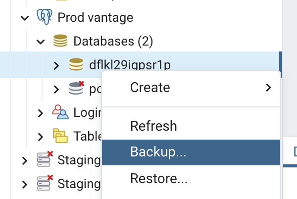
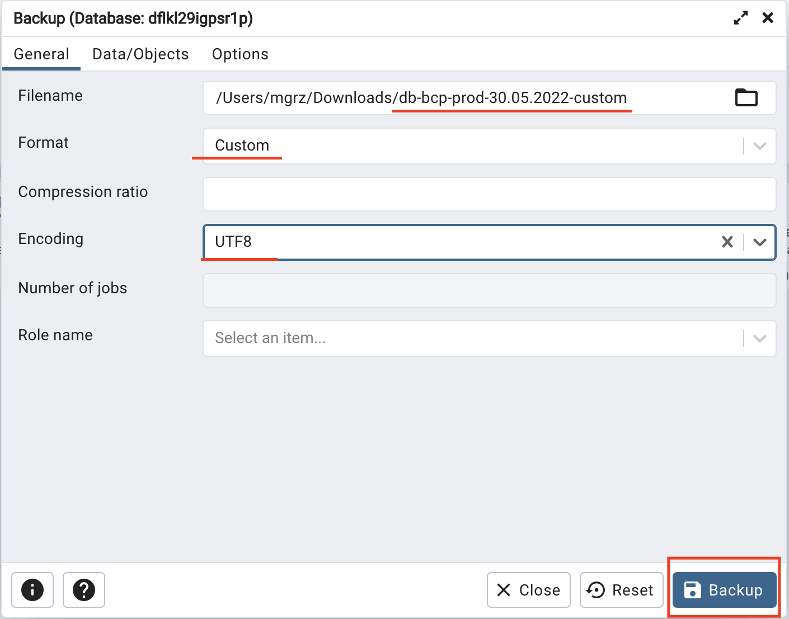
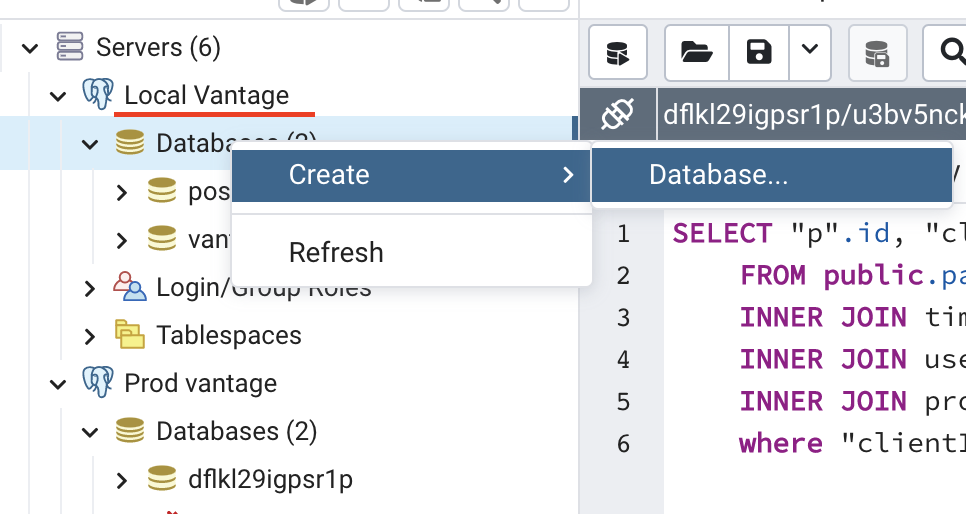
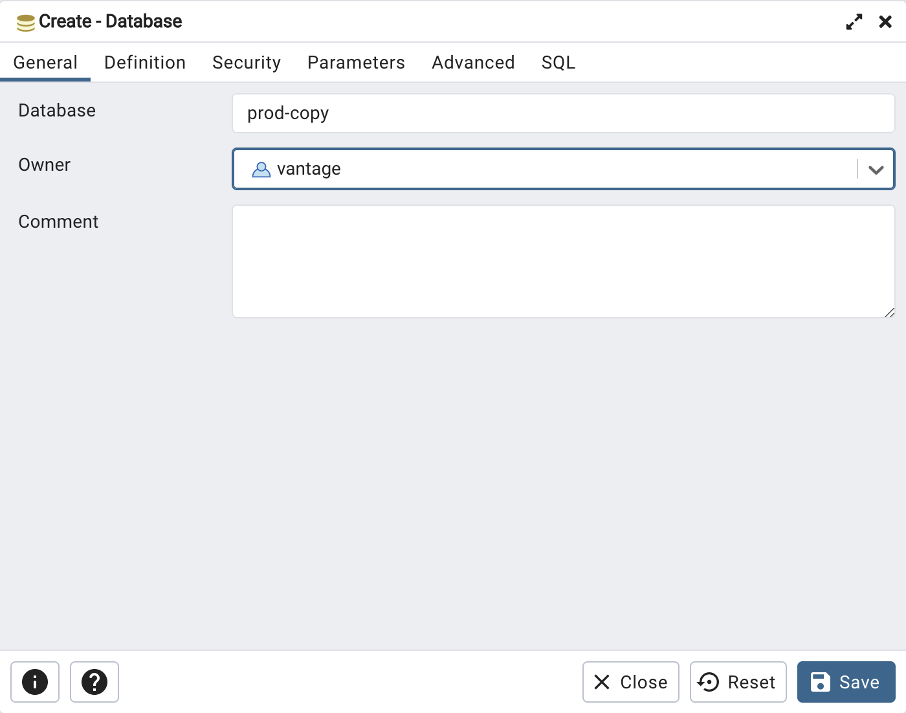
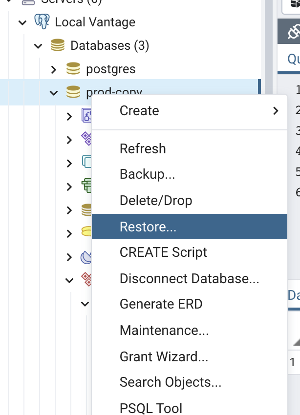
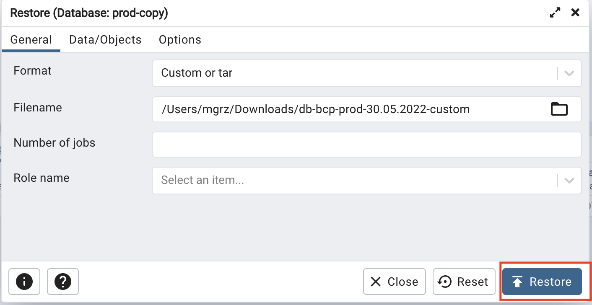

# Backup Database

Please follow steps below to backup Database with pgAdmin 4.

1. 
2. 

# Restore Database

Please follow steps below to restore Database with pgAdmin 4.

1. 
2. 
3. 
4. 
5. Optional caveat that might happen to your procedure: If your backup is coming from other user you might need to create exactly the same user with privileges as from the original database you have backed up. So you might need a user on top of "vantage" or "postgres" to make it work.
